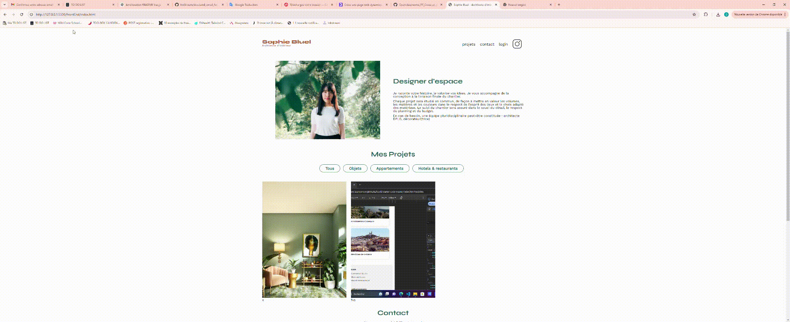

# APP SOPHIE BUEL

## Description

This project involves creating a dynamic web page for an interior designer's website using JavaScript and communicating with an API.

## application visualization

- **Demo**  
  

## Features
- Add photo from api in home page
- Filter photos according to their categories
- Connection setup
- Add photos from our device
- Modal creation
- Delete photo

## Build
Frontend: Vanilla js, css

## Installation
Clone the repository:
git clone repository_name

Install dependencies:
npm install

Start the application:
Frontend : open html page
Backend : npm run start

## information to connect to the application account
email : sophie.bluel@test.tld
password : S0phie